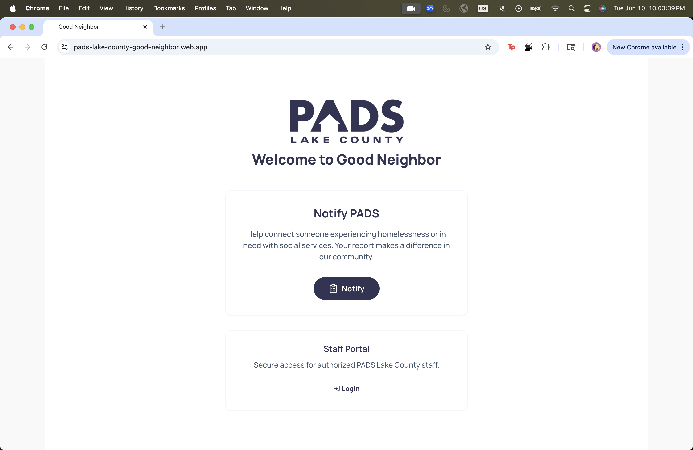
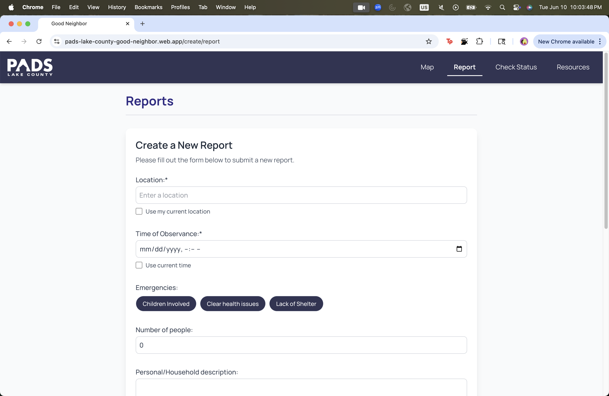
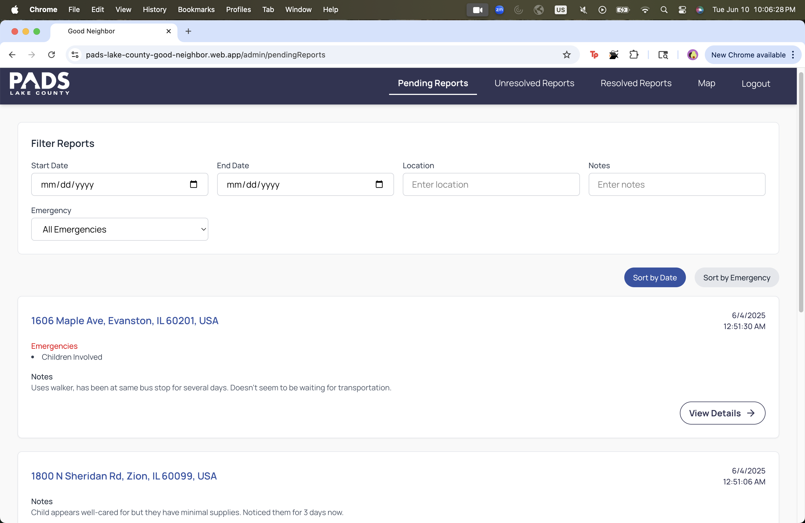

# PADS Good Neighbor Reporting App

## What is the app?

This is a React web application for PADS Lake County staff and community members to **report, track, and manage incidents** involving individuals experiencing homelessness or in need of social services. The app provides:

- **Public reporting**: Community members can submit reports about individuals in need.
- **Admin console**: Staff can view, filter, and resolve reports, as well as add notes to communicate with the reporters about the status of the reports.
- **Realtime updates**: All data is stored in Firebase Realtime Database and updates live for all users.
- **Heatmap**: A heatmap is shown for both the client side and the admin side to show a distribution of reports. Admin can see the details of each report on the heatmap.
- **Authentication**: Staff login is required for admin features.

---

## What does it look like?

**Landing Page:**  

https://pads-lake-county-good-neighbor.web.app/

**Reporting Page for the User:**  

https://pads-lake-county-good-neighbor.web.app/create/report

**Admin Console:**  

https://pads-lake-county-good-neighbor.web.app/admin/pendingReports


---

## How to install and run the app

### Prerequisites

- **Node.js** version 20 or greater
- **npm** (comes with Node.js)

### Installation

1. **Clone the repository:**
   ```bash
   git clone https://github.com/your-org/pads.git
   cd pads
   ```
   If using confirmation email functionality, please clone the *emails branch* with this implementation:
   ```bash
   git clone --single-branch --branch emails https://github.com/394-s25/pads.git
   cd pads
   ```

2. **Install dependencies:**
   ```bash
   npm install
   ```

3. **Set up Firebase (see below).**

4. **Start the development server:**
   ```bash
   npm start
   ```
   or
   ```bash
   npm run dev
   ```

   If using the confirmation email functionality, first start up the email server as follows:
   ```bash
   'node server/server.js'
   ```

   ```bash
   npm start
   ```
   or
   ```bash
   npm run dev
   ```

5. **Run tests:**
   ```bash
   npm test
   ```

---

## How to set up Firebase

### 1. **Create a Firebase Project**

- Go to [Firebase Console](https://console.firebase.google.com/).
- Click "Add project" and follow the steps.

### 2. **Enable Authentication**

- In your Firebase project, go to **Authentication > Sign-in method**.
- Enable **Google** sign-in.

### 3. **Enable Realtime Database**

- Go to **Build > Realtime Database**.
- Click "Create Database" and choose a location.
- Set rules to allow authenticated users to read/write as needed.

### 4. **Get your Firebase config**

- In **Project settings > General**, scroll to "Your apps" and copy the Firebase config object.

### 5. **Configure the app**

- Open `src/firebaseConfig.js`.
- Replace the placeholder config with your actual Firebase config:

  ```js
  const firebaseConfig = {
    apiKey: "YOUR_API_KEY",
    authDomain: "YOUR_AUTH_DOMAIN",
    databaseURL: "YOUR_DATABASE_URL",
    projectId: "YOUR_PROJECT_ID",
    storageBucket: "YOUR_STORAGE_BUCKET",
    messagingSenderId: "YOUR_MESSAGING_SENDER_ID",
    appId: "YOUR_APP_ID",
    measurementId: "YOUR_MEASUREMENT_ID"
  };
  ```

### 6. **Import starting data (optional)**

- Our app does not require any starting data. However, if you would like to import some starting data, use the Firebase Console to import a sample JSON file into your Realtime Database, or let the app create data as you use it.

---


## Customizations

- If you would like to edit the resources displayed on the resource page or thier descriptions, you can do so in  public/resources.json. You can simply edit the text inside the quotes to be to your preferences.

## Other third-party connections

- **Google Maps API**: Used for geocoding and displaying maps.  
  - Get an API key from [Google Cloud Console](https://console.cloud.google.com/).
  - Add your API key to your `.env` file as `VITE_GOOGLE_MAPS_API_KEY=your_key_here`.

- **Twillio SendGrid API**: Used for sending email notifications.
  - Sign up for SendGrid at [SendGrid Signup](https://login.twilio.com/u/signup).
  - Get an API key for outreach@padslakecounty.org at [SendGrid Web API](https://app.sendgrid.com/guide/integrate/langs/nodejs)
      - Alternatively, navigate form SendGrid home to Email API -> Integration Guide -> Web API -> Node.js -> 
        Create Key (copy to clip board here and save in a safe place, you will not be able to see the key again)
        -> check I've integrated the code above.
      - Add your API key to your `.env` file as `SENDGRID_API_KEY=your_key_here`.
      - Change `to: 'test@example.com'` to be an email you have access to.
      - In the folder pads, run the command `node verifyEmail.js` to test configuration.
      - Once you confirm recipt the test email, select Verify Integration in SendGrid to finish setting up. 
   - You can edit the contents of the confirmation email in server/sendEmail.js.

---

## Known bugs

- **Email domain check**: The staff login currently accepts any email for testing; update the domain check in `authProvider.jsx` for production.

---